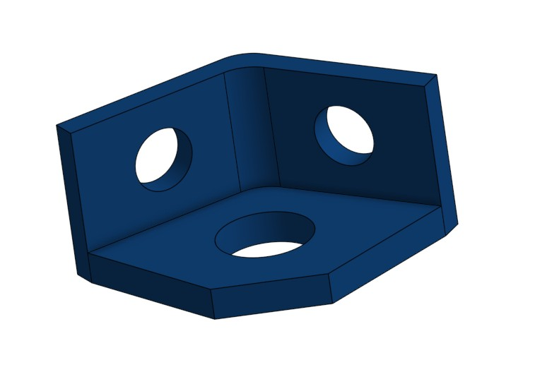
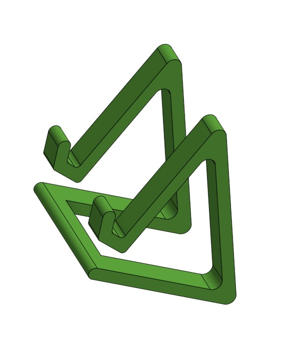
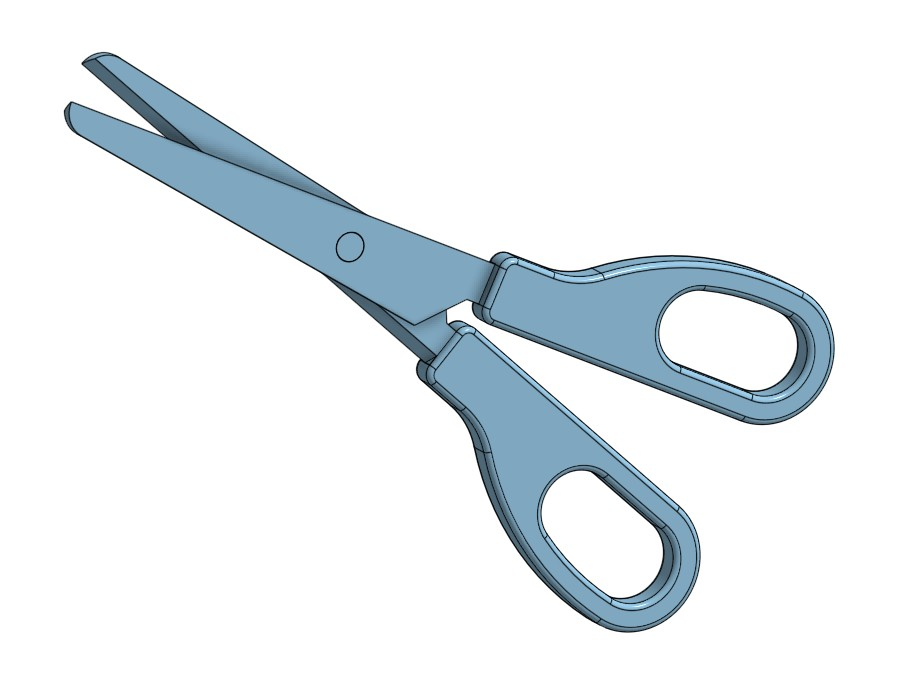
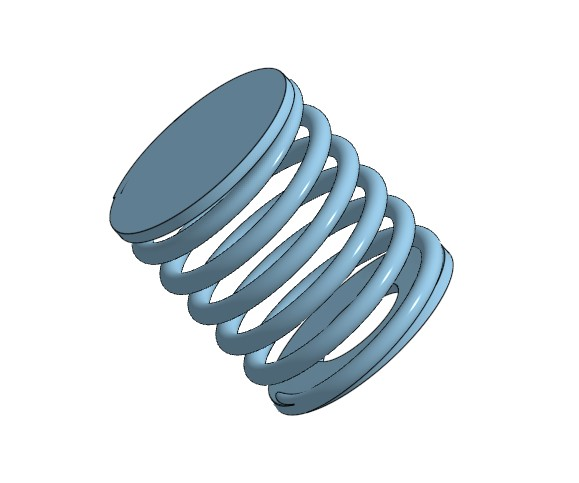

# Séance 2 : 19 Janvier 2026 - Conception Assistée par Ordinateur (CAD)

## Objectifs de la séance
* Comprendre les principes de la modélisation paramétrique.
* Prendre en main le logiciel **Onshape**.
* Réaliser des pièces techniques complexes (Extrusion, Révolution, Balayage).

## Résumé du cours
### 1. Théorie CAD
[cite_start]La Conception Assistée par Ordinateur (CAO) permet de créer, analyser et optimiser des conceptions numériques avant fabrication.
* [cite_start]**Raster vs Vector :** Contrairement aux images matricielles (pixels), la CAO utilise des vecteurs (formes géométriques) qui sont infiniment redimensionnables sans perte de qualité.
* [cite_start]**Choix du logiciel :** Nous utilisons **Onshape**, un outil "Cloud-based" qui permet la collaboration en temps réel et ne nécessite pas d'installation, contrairement à SolidWorks qui demande une machine performante.

### 2. Fonctionnalités clés d'Onshape
Nous avons exploré les fonctions essentielles pour passer de la 2D (Sketch) à la 3D :
* [cite_start]**Volumes :** Extrude (Extrusion), Revolve (Révolution), Loft (Lissage).
* [cite_start]**Modifications :** Fillet (Congé), Chamfer (Chanfrein), Shell (Coque).
* **Workflow Électronique :** Découverte de la possibilité d'exporter un PCB depuis **KiCad** vers Onshape. Cela permet de concevoir le boîtier directement autour des composants électroniques pour éviter les erreurs de dimensions.

## Travaux Pratiques : Exercices d'application
J'ai réalisé une série d'exercices pour valider mes compétences sur le logiciel.

### Exercice 1 : Pièce d'angle (1143)
*Réalisé en classe avec le professeur.*
Apprentissage des esquisses contraintes et des perçages.

### Exercice 2 : Support (1117)
Utilisation des tangentes et des extrusions symétriques.

### Exercice 3 : Ciseaux (1101)
Assemblage et gestion des contraintes géométriques complexes.

### Exercice 4 & 5 : Avancé (Flange & Spring)
*Réalisés en autonomie.*
* [cite_start]**Flange (Bride) :** Travail sur les formes courbes et les lissages (Loft).
* [cite_start]**Spring (Ressort) :** Utilisation de la fonction Hélice (Helix) et Balayage (Sweep).

## Avancement du Projet LumaDome
Bien que je n'ai pas encore modélisé la base spécifique du LumaDome, cette séance m'a donné les compétences nécessaires pour le faire.
* **Acquis :** Je suis désormais capable de modéliser le cylindre de base et d'y intégrer les fixations pour le PCB.
* **Prochaine étape :** Créer le fichier "LumaDome_Base" sur Onshape et importer l'empreinte du futur PCB.

## ✅ Tâches effectuées
- [x] Création du compte Onshape Education.
- [x] Réalisation des 5 exercices du TP (Basiques + Avancés).
- [ ] Modélisation de la base du projet LumaDome (Reporté).