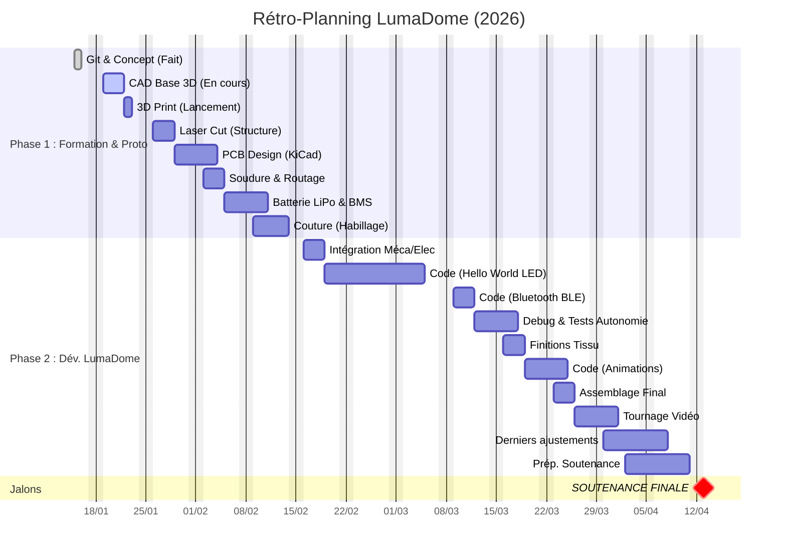

# 2526_Maker_LumaDome

##  Présentation du projet
**LumaDome** est une lampe d'ambiance connectée et intelligente. L'objectif est d'allier esthétique et technique pour afficher des messages dynamiques. Conçue comme un objet design hybride, elle associe une base imprimée en 3D, un abat-jour textile structuré par découpe laser et l'électronique sur mesure et la gestion d'énergie.

Au-delà de l'esthétique, l'objectif est de créer une interface lumineuse capable de :
* Afficher des **notifications visuelles** (ex: simulateur d'aube au réveil).
* Diffuser des **messages personnalisés** envoyés en Bluetooth depuis un smartphone.
* Être totalement **nomade** grâce à une batterie intégrée.

🔗 **Lien vers la présentation complète :** [Insérer le lien ici plus tard]

## 🛠 Architecture Technique
Ce projet mobilise 4 axes principaux :
1.  **Mécanique :** Base cylindrique (Impression 3D) contenant l'électronique + Structure haute (Découpe Laser) supportant le textile.
2.  **Électronique :** PCB sur mesure avec microcontrôleur (type ESP32) pour la gestion LED et Bluetooth.
3.  **Énergie :** Système autonome sur batterie LiPo avec gestion de charge (BMS).
4.  **Habillage :** Travail du textile (Couture) pour la diffusion de la lumière.

##  Rétroplanning Prévisionnel

Ce planning s'aligne sur les séances de formation technique du semestre.

| Date | Phase | Objectifs spécifiques LumaDome |
| :--- | :--- | :--- |
| **19 Janv** | CAD (Conception) | Modélisation 3D de la base (support PCB) et esquisse de la structure laser. |
| **22 Janv** | 3D Print | Lancement de l'impression du prototype de la base. |
| **26 Janv** | Laser Cut | Découpe du squelette/cadre pour l'abat-jour. |
| **29 Janv** | PCB Design | Conception de la carte électronique (ESP32 + Driver LED). |
| **05 Fév** | Batterie (LiPo) | Dimensionnement de la batterie et intégration du BMS. |
| **09 Fév** | Couture | Patronage et assemblage du tissu sur la structure laser. |
| **Fév - Mars** |  Code & Finalisations| Développement du firmware (Bluetooth & Animations) + finalisation des choses pas terminer|
| **Avril** | Finalisation | Assemblage final, finitions et tournage vidéo. |

---